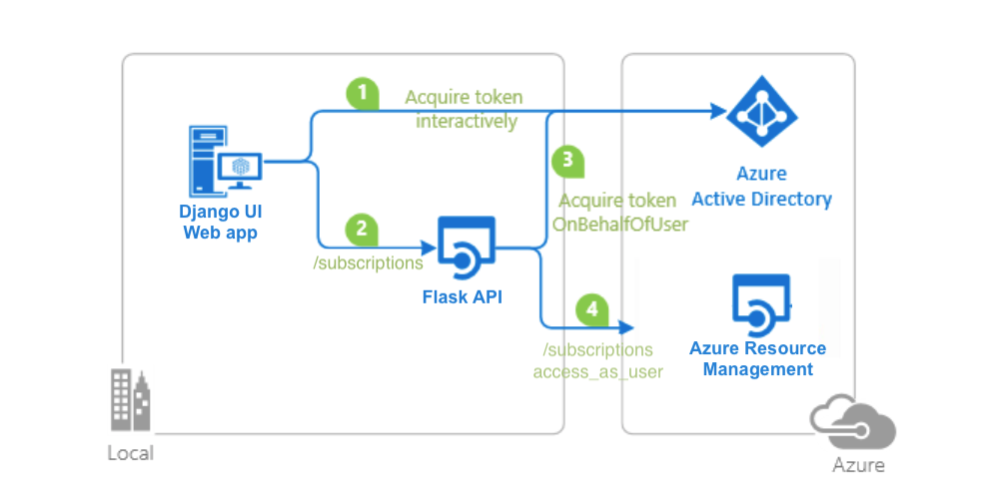

# Enable your Python Flask API to call the Azure Management API on a user's behalf from your Python Django Web App with the Microsoft Identity Platform

 1. [Overview](#overview)
 1. [Scenario](#scenario)
 1. [Contents](#contents)
 1. [Prerequisites](#prerequisites)
 1. [Setup](#setup)
 1. [Registration](#registration)
 1. [Running the sample](#running-the-sample)
 1. [Explore the sample](#explore-the-sample)
 1. [About the code](#about-the-code)
 1. [Deployment](#deployment)
 1. [More information](#more-information)
 1. [Community Help and Support](#community-help-and-support)
 1. [Contributing](#contributing)

## Overview

This sample demonstrates a Python Django Web App calling a Python Flask Web API that is secured using Azure AD using the [Microsoft Authentication Library \(MSAL\) for Python](https://github.com/AzureAD/microsoft-authentication-library-for-python).

## Scenario

1. The client Python Django Web App uses the Microsoft Authentication Library (MSAL) to sign-in and obtain an [Access Token](https://docs.microsoft.com/azure/active-directory/develop/access-tokens) from **Azure AD**.
2. The access token is used as a bearer token to authorize the user to call the Python Flask Web API protected by **Azure AD**.
3. The Python Flask Web API then receives a token for **Azure Resource Management** API using the [On-Behalf-Of](https://docs.microsoft.coms/azure/active-directory/develop/v2-oauth2-on-behalf-of-flow) flow.



## Contents

| File/folder       | Description                                |
|-------------------|--------------------------------------------|
| `AppCreationScripts/`| Scripts to automatically configure Azure AD app registrations.|
| `DjangoUI/`| The web app that signs the user in|
| `FlaskAPI/`| The protected resource API that performs the On-Behalf-Of flow.|
| `CHANGELOG.md`    | List of changes to the sample.             |
| `CONTRIBUTING.md` | Guidelines for contributing to the sample. |
| `LICENSE`         | The license for the sample.                |

## Prerequisites

- [Python 3.8](https://www.python.org/downloads/)
- A [virtual environment](https://docs.python.org/3/tutorial/venv.html) for each application to to work from
- If using VS Code, select the [Python interpreter](https://code.visualstudio.com/docs/languages/python) from the virtual environment
- An Azure Active Directory (Azure AD) tenant. For more information on how to get an Azure AD tenant, see [How to get an Azure AD tenant](https://azure.microsoft.com/documentation/articles/active-directory-howto-tenant/)
- A user account in your own Azure AD tenant. This sample will not work with a **personal Microsoft account**. If have not yet [created a user account](https://docs.microsoft.com/azure/active-directory/fundamentals/add-users-azure-active-directory) in your AD tenant yet, you should do so before proceeding
  
> - Configure [VS Code](https://code.visualstudio.com/docs/python/python-tutorial) for debugging Python applications

## Setup

### Step 1: Clone or download this repository

From your shell or command line:

```console
    git clone https://github.com/Azure-Samples/ms-identity-python-on-behalf-of.git
```

or download and extract the repository .zip file.

> :warning: To avoid path length limitations on Windows, we recommend cloning into a directory near the root of your drive.

### Step 2: Install project dependencies

1. Navigate to the folder where you cloned this project
2. If using VS Code, open each project sub-folder (`DjangoUI` and `FlaskAPI`) in separate VS Code instances.
3. Activate your Python 3 virtual environment (either directly in the [command line](https://docs.python.org/3/tutorial/venv.html#creating-virtual-environments) or [VS Code](https://code.visualstudio.com/docs/languages/python))
4. You will need to install dependencies using pip
   1. The below shell commands must be executed in both applications as they both have separate requirements.txt files  
   2. There is also Pipfile included in both applications if you prefer to use [pipenv](https://pypi.org/project/pipenv/) instead

In the 'FlaskAPI' sub-folder, use the following command:

   ```Shell
   # start from the directory in which this sample is clone into
   cd FlaskAPI
   python3 -m venv venv # only required if you don't have a venv already
   source venv/bin/activate
   pip install -r requirements.txt
   ```

In the 'DjangoUI' sub-folder, local execution only, use the following command:

  ```Shell
  # start from the directory in which this sample is clone into
  cd DjangoUI
  python3 -m venv venv # only required if you don't have a venv already
  Set-ExecutionPolicy -ExecutionPolicy RemoteSigned -Scope Process -Force
  . .\venv\Scripts\Activate.ps1
  pip install -r requirements.txt
  ```

### Register the sample application(s) with your Azure Active Directory tenant

There are two projects in this sample. Each needs to be separately registered in your Azure AD tenant. To register these projects, you can:

- follow the steps below for manually register your apps
- or use PowerShell scripts that:
  - **automatically** creates the Azure AD applications and related objects (passwords, permissions, dependencies) for you.
  - modify the projects' configuration files.

<details>
  <summary>Expand this section if you want to use this automation:</summary>

> :warning: If you have never used **Azure AD Powershell** before, we recommend you go through the [App Creation Scripts](./AppCreationScripts/AppCreationScripts.md) once to ensure that your environment is prepared correctly for this step.

1. On Windows, run PowerShell as **Administrator** and navigate to the root of the cloned directory
1. If you have never used Azure AD Powershell before, we recommend you go through the [App Creation Scripts](./AppCreationScripts/AppCreationScripts.md) once to ensure that your environment is prepared correctly for this step.
1. In PowerShell run:

   ```PowerShell
   Set-ExecutionPolicy -ExecutionPolicy RemoteSigned -Scope Process -Force
   ```

1. Run the script to create your Azure AD application and configure the code of the sample application accordingly.
1. In PowerShell run:

   ```PowerShell
   cd .\AppCreationScripts\
   .\Configure.ps1
   ```

   > Other ways of running the scripts are described in [App Creation Scripts](./AppCreationScripts/AppCreationScripts.md)
   > The scripts also provide a guide to automated application registration, configuration and removal which can help in your CI/CD scenarios.

</details>

### Choose the Azure AD tenant where you want to create your applications

As a first step you'll need to:

1. Sign in to the [Azure portal](https://portal.azure.com).
1. If your account is present in more than one Azure AD tenant, select your profile at the top right corner in the menu on top of the page, and then **switch directory** to change your portal session to the desired Azure AD tenant.

### Register the service app (Python Flask Web API)

1. Navigate to the [Azure portal](https://portal.azure.com) and select the **Azure AD** service.
1. Select the **App Registrations** blade on the left, then select **New registration**.
1. In the **Register an application page** that appears, enter your application's registration information:
   - In the **Name** section, enter a meaningful application name that will be displayed to users of the app, for example `Python Flask Web API`.
   - Under **Supported account types**, select **Accounts in this organizational directory only**.
1. Select **Register** to create the application.
1. In the app's registration screen, find and note the **Application (client) ID**. You use this value in your app's configuration file(s) later in your code.
1. Select **Save** to save your changes.
1. In the app's registration screen, select the **Certificates & secrets** blade in the left to open the page where we can generate secrets and upload certificates.
1. In the **Client secrets** section, select **New client secret**:
   - Type a key description (for instance `app secret`),
   - Select one of the available key durations (**In 1 year**, **In 2 years**, or **Never Expires**) as per your security posture.
   - The generated key value will be displayed when you select the **Add** button. Copy the generated value for use in the steps later.
   - You'll need this key later in your code's configuration files. This key value will not be displayed again, and is not retrievable by any other means, so make sure to note it from the Azure portal before navigating to any other screen or blade.
1. In the app's registration screen, select the **API permissions** blade in the left to open the page where we add access to the APIs that your application needs.
   - Select the **Add a permission** button and then,
   - Ensure that the **Microsoft APIs** tab is selected.
   - In the list of APIs, select the API `Azure Service Management`.
   - In the **Delegated permissions** section, select the **user_impersonation** in the list. Use the search box if necessary.
   - Select the **Add permissions** button at the bottom.
1. In the app's registration screen, select the **Expose an API** blade to the left to open the page where you can declare the parameters to expose this app as an API for which client applications can obtain [access tokens](https://docs.microsoft.com/azure/active-directory/develop/access-tokens) for.
The first thing that we need to do is to declare the unique [resource](https://docs.microsoft.com/azure/active-directory/develop/v2-oauth2-auth-code-flow) URI that the clients will be using to obtain access tokens for this Api. To declare an resource URI, follow the following steps:
   - Select `Set` next to the **Application ID URI** to generate a URI that is unique for this app.
   - For this sample, accept the proposed Application ID URI (`api://{clientId}`) by selecting **Save**.
1. All APIs have to publish a minimum of one [scope](https://docs.microsoft.com/azure/active-directory/develop/v2-oauth2-auth-code-flow#request-an-authorization-code) for the client's to obtain an access token successfully. To publish a scope, follow the following steps:
   - Select **Add a scope** button open the **Add a scope** screen and Enter the values as indicated below:
        - For **Scope name**, use `access_as_user`.
        - Select **Admins and users** options for **Who can consent?**.
        - For **Admin consent display name** type `Access Python Flask Web API`.
        - For **Admin consent description** type `Allows the app to access Python Flask Web API as the signed-in user.`
        - For **User consent display name** type `Access Python Flask Web API`.
        - For **User consent description** type `Allow the application to access Python Flask Web API on your behalf.`
        - Keep **State** as **Enabled**.
        - Select the **Add scope** button on the bottom to save this scope.
1. In the **Manifest** section, make sure to change the value fore *acceptedTokenVersion* to **2**.

#### Configure the service app (Python Flask Web API) to use your app registration

Open the project in your IDE (like Visual Studio or Visual Studio Code) to configure the code.

> In the steps below, "ClientID" is the same as "Application ID" or "AppId".

1. In the 'FlaskAPI' sub-folder, open the `FlaskAPI\production.env` file and make a copy in the same directory called `development.env`. In this new file:
2. Find the key `CLIENT_ID` and replace the existing value with the application ID (clientId) of `Python Flask Web API` app copied from the Azure portal.
3. Find the key `CLIENT_SECRET` and replace the existing value with the key you saved during the creation of `Python Flask Web API` copied from the Azure portal.
4. Find the key `AUTHORITY` and replace the `ReplaceWithTenantID` portion with the tenant ID value that you obtained from the portal.
5. Find the key `ISSUER` and replace the `ReplaceWithTenantID` portion with the tenant ID value that you obtained from the portal.

### Register the client app (Python Django Web App)

1. Navigate to the [Azure portal](https://portal.azure.com) and select the **Azure AD** service.
1. Select the **App Registrations** blade on the left, then select **New registration**.
1. In the **Register an application page** that appears, enter your application's registration information:
   - In the **Name** section, enter a meaningful application name that will be displayed to users of the app, for example `Python Django Web App`.
   - Under **Supported account types**, select **Accounts in this organizational directory only**.
   - In the **Redirect URI (optional)** section, select **Web** in the combo-box and enter the following redirect URI: `http://localhost:8000/account/callback`.
1. Select **Register** to create the application.
1. In the app's registration screen, find and note the **Application (client) ID**. You use this value in your app's configuration file(s) later in your code.
1. Select **Save** to save your changes.
1. In the app's registration screen, select the **Certificates & secrets** blade in the left to open the page where we can generate secrets and upload certificates.
1. In the **Client secrets** section, select **New client secret**:
   - Type a key description (for instance `app secret`),
   - Select one of the available key durations (**In 1 year**, **In 2 years**, or **Never Expires**) as per your security posture.
   - The generated key value will be displayed when you select the **Add** button. Copy the generated value for use in the steps later.
   - You'll need this key later in your code's configuration files. This key value will not be displayed again, and is not retrievable by any other means, so make sure to note it from the Azure portal before navigating to any other screen or blade.
1. In the app's registration screen, select the **API permissions** blade in the left to open the page where we add access to the APIs that your application needs.
   - Select the **Add a permission** button and then:

   - Ensure that the **My APIs** tab is selected.
   - In the list of APIs, select the API `Python Flask Web API`.
   - In the **Delegated permissions** section, select the **access_as_user** in the list. Use the search box if necessary.
   - Select the **Add permissions** button at the bottom.
   - Select the **Add a permission** button and then:

   - Ensure that the **Microsoft APIs** tab is selected.
   - In the list of APIs, select the API `Microsoft Graph API`.
   - In the **Delegated permissions** section, select the **openid** in the list. Use the search box if necessary.
   - Select the **Add permissions** button at the bottom.
1. In the **Manifest** section, make sure to change the value fore *acceptedTokenVersion* to **2**.

#### Configure the client app (Python Django Web App) to use your app registration

Open the project in your IDE (like Visual Studio or Visual Studio Code) to configure the code.

> In the steps below, "ClientID" is the same as "Application ID" or "AppId".

1. In the 'DjangoUI' sub-folder, open the `DjangoUI\production.env` file and make a copy in the same directory called `development.env`. In this new file:
2. Find the key `CLIENT_ID` and replace the existing value with the application ID (clientId) of `Python Django Web App` app copied from the Azure portal.
3. Find the key `CLIENT_SECRET` and replace the existing value with the key you saved during the creation of `Python Django Web App` copied from the Azure portal.
4. Find the key `DJANGO_SECRET_KEY` and replace the existing value with a Secret Key.
5. Find the key `AUTHORITY` and replace the `ReplaceWithTenantID` portion with the tenant Id value that you obtained from the portal.
6. Find the key `SCOPE` and replace the `Flask_API_Client_ID` portion of the existing value with with the client ID of the Flask app that you had copied from that portal in the previous section.
7. Find the key `API_SCOPE` and replace the `Flask_API_Client_ID` portion of the existing value with with the client ID of the Flask app that you had copied from that portal in the previous section.

#### Configure Known Client Applications for service (Python Flask Web API)

For a middle tier Web API (`Python Flask Web API`) to be able to call a downstream Web API, the middle tier app needs to be granted the required permissions as well.
However, since the middle tier cannot interact with the signed-in user, it needs to be explicitly bound to the client app in its **Azure AD** registration.
This binding merges the permissions required by both the client and the middle tier Web Api and presents it to the end user in a single consent dialog. The user then consent to this combined set of permissions.

To achieve this, you need to add the **Application Id** of the client app, in the Manifest of the Web API in the `knownClientApplications` property. Here's how:

1. In the [Azure portal](https://portal.azure.com), navigate to your `Python Flask Web API` app registration, and select **Manifest** section.
1. In the manifest editor, change the `"knownClientApplications": []` line so that the array contains the Client ID of the client application (`Python Django Web App`) as an element of the array.

    For instance:

    ```json
    "knownClientApplications": ["your-django-app-id"],
    ```

1. **Save** the changes to the manifest.

## Running the sample

There are two applications in this repository. You must run both of them to use the sample.

### FlaskAPI

To run the FlaskAPI application, you can either use the command line or VS Code. For command line use, navigate to `<project-root>/FlaskAPI` folder. Be sure your virtual environment with dependencies is activated ([Prerequisites](#prerequisites)).

- On Linux/OSX via the terminal:

  ```Shell
    # start from the folder in which the sample is cloned into
    cd FlaskAPI
    export FLASK_ENV="development"
    export FLASK_APP="main.py"
    flask run
  ```

- On Windows:

  ```PowerShell
    # start from the folder in which the sample is cloned into
    cd FlaskAPI
    $env:FLASK_ENV="development"
    $env:FLASK_APP="main.py"
    flask run
  ```

- On VS Code:

 1. Open VS Code in the FlaskAPI project folder
 2. Open the command palette (ctrl+shift+P) and select `Python: Select Interpreter` and choose the virtual environment that you installed the project into.
 3. Run the **Python: Flask** launch configuration

### DjangoUI

To run the DjangoUI application, you can either use the command line or VS Code. For command line use, navigate to `<project-root>/DjangoUI` folder. Be sure your virtual environment with dependencies is activated ([Prerequisites](#prerequisites)).

- On Linux/OSX via the terminal:

  ```Shell
    # start from the folder in which the sample is cloned into
    cd DjangoUI
    export ENVIRONMENT="development"
    python manage.py migrate
    python manage.py runserver localhost:8000
  ```

- On Windows:

  ```PowerShell
    # start from the folder in which the sample is cloned into
    cd DjangoUI
    $env:ENVIRONMENT="development"
    python manage.py migrate
    python manage.py runserver localhost:8000
  ```

- On VS Code:

 1. Open VS Code in the DjangoUI project folder
 2. Open the command palette (ctrl+shift+P) and select `Python: Select Interpreter` and choose the virtual environment that you installed the project into.
 3. Run the **Python: Django: Run Migrations** launch configuration
 4. Run the **Python: Django** launch configuration

### Open your browser

Navigate to [http://localhost:8000](http://localhost:8000) in your browser (**Don't use** use 127.0.0.1)

## Explore the sample

- After starting the application, Follow the instructions on the next page to sign in with an account in the Azure AD tenant.
- On the consent screen, note the scopes that are being requested.
- Note the screen should now display a JSON based array of all Azure subscriptions you have access to

> :information_source: Did the sample not work for you as expected? Then please reach out to us using the [GitHub Issues](../../../issues) page.

## We'd love your feedback!

Were we successful in addressing your learning objective? Consider taking a moment to [share your experience with us](https://forms.office.com/Pages/ResponsePage.aspx?id=v4j5cvGGr0GRqy180BHbR0TE6SUcVQZKq_Wiw2LQUqdUOUdIUExaSEk2TUFUQTNJSEJaMEpWQzZVQS4u).

## About the code

This sample uses the [Microsoft Authentication Library \(MSAL\) for Python](https://github.com/AzureAD/microsoft-authentication-library-for-python) to sign in a user and obtain a token for the Flask Web API, which will in turn call the Azure Management API on the user's behalf. The Django Web App first checks to see if the user has signed in before by attempting to find the user in the in-memory token cache. If the user is found, the MSAL acquire_token_silent function is first called to pull the user's access token from the token cache and then the Flask API is called. If the user is not found in the token cache, they will be redirect to account/login to sign in. Once called, the Flask API will validate the access token, using the validation logic from [authorization.py](/FlaskAPI/helpers/authorization.py), and will in turn create a new access token using the MSAL acquire_token_on_behalf_of function. This token will then be used to call the Azure Management API, subscriptions endpoint, on-behalf-of the user who initiated the request from the Django Web App.

## More information

- [Microsoft identity platform (Azure Active Directory for developers)](https://docs.microsoft.com/azure/active-directory/develop/)
- [Overview of Microsoft Authentication Library (MSAL)](https://docs.microsoft.com/azure/active-directory/develop/msal-overview)
- [Quickstart: Register an application with the Microsoft identity platform (Preview)](https://docs.microsoft.com/azure/active-directory/develop/quickstart-register-app)
- [Quickstart: Configure a client application to access web APIs (Preview)](https://docs.microsoft.com/azure/active-directory/develop/quickstart-configure-app-access-web-apis)
- [Understanding Azure AD application consent experiences](https://docs.microsoft.com/azure/active-directory/develop/application-consent-experience)
- [Understand user and admin consent](https://docs.microsoft.com/azure/active-directory/develop/howto-convert-app-to-be-multi-tenant#understand-user-and-admin-consent)
- [Application and service principal objects in Azure Active Directory](https://docs.microsoft.com/azure/active-directory/develop/app-objects-and-service-principals)
- [National Clouds](https://docs.microsoft.com/azure/active-directory/develop/authentication-national-cloud#app-registration-endpoints)
- [MSAL code samples](https://docs.microsoft.com/azure/active-directory/develop/sample-v2-code)

For more information about how OAuth 2.0 protocols work in this scenario and other scenarios, see [Authentication Scenarios for Azure AD](https://docs.microsoft.com/azure/active-directory/develop/authentication-flows-app-scenarios).

## Community Help and Support

Use [Stack Overflow](http://stackoverflow.com/questions/tagged/msal) to get support from the community.
Ask your questions on Stack Overflow first and browse existing issues to see if someone has asked your question before.
Make sure that your questions or comments are tagged with [`azure-active-directory` `azure-ad-b2c` `ms-identity` `adal` `msal`].

If you find a bug in the sample, raise the issue on [GitHub Issues](../../../issues).

To provide feedback on or suggest features for Azure Active Directory, visit [User Voice page](https://feedback.azure.com/forums/169401-azure-active-directory).

## Contributing

If you'd like to contribute to this sample, see [CONTRIBUTING.MD](/CONTRIBUTING.md).

This project has adopted the [Microsoft Open Source Code of Conduct](https://opensource.microsoft.com/codeofconduct/). For more information, see the [Code of Conduct FAQ](https://opensource.microsoft.com/codeofconduct/faq/) or contact [opencode@microsoft.com](mailto:opencode@microsoft.com) with any additional questions or comments.
